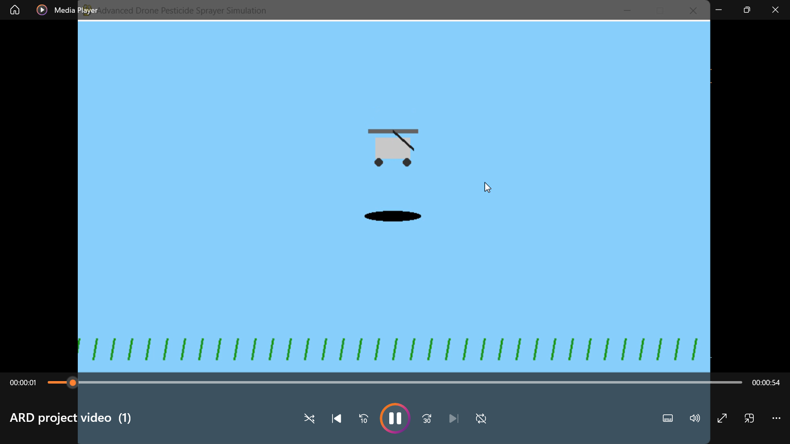
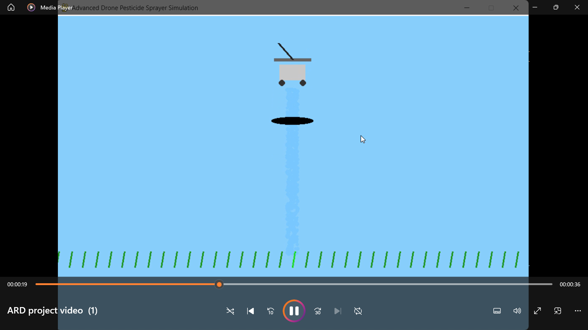
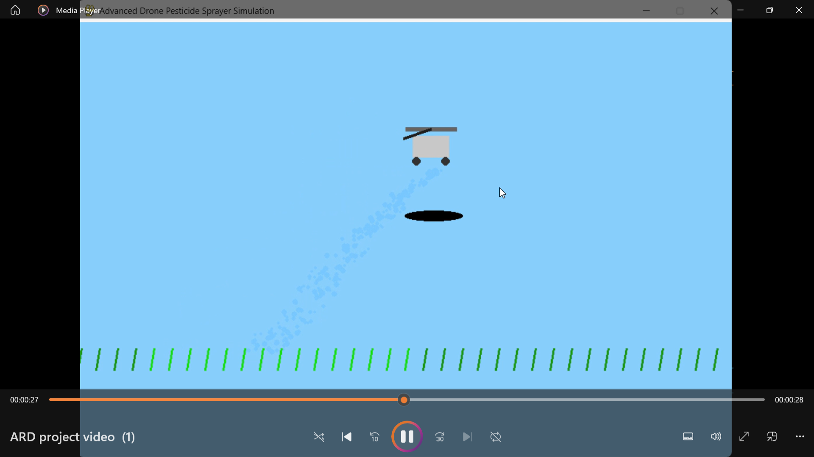

# Advanced Drone Pesticide Sprayer Simulation

A Python + Pygame based simulation of an agricultural drone used for pesticide spraying and flow control.

## Features
- Realistic drone movement
- Adjustable spray flow control
- Interactive crop health system
- Propeller animation
- Altitude-based spray dispersion
- Real-time pesticide particle simulation

## Technologies Used
- Python
- Pygame

## Controls
- Arrow Keys → Move Drone
- SPACE → Toggle Spray
- 1 / 2 / 3 → Change Spray Flow

## Demo Video

Demo: https://youtu.be/rXtvIowEqDk

## Screenshots

### Drone Simulation

### Spray System

### Crop Interaction

## Future Improvements
- AI-based crop analysis
- OpenCV integration
- Autonomous path planning
- Real-time telemetry visualization

## Authors
- Divija Kalra
- Zoya Altaf
